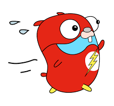

# *Go Introduction*


---

# *Go Introduction*


* Robert Griesemer, Rob Pike & Ken Thompson
* For them, C++ is awesome on the runtime side, but complex to use and with too much compilation time. Java does better on the compilation side, but still too complex to use. Python is easy to use, but not fast enough. 
---

# *Go main features*

* near c++ performance
* Static Typing and gc
* compilation to machine code directly cross-comp & small binary size, __statically linked__ (i.e. no dependecy)
* Powerful Standard Library (net/http) and Tool Set
* 'Cloud Native'
* __Concurrency__ 🚀
* borring to read 🤯


---

# *Who uses go*
| Application       |      DevOps Tools      |  Misc |
|:----------        |:--------:              |------:|
| Uber              |  Docker                | Ethereum |
| Slack             |    Kubernetes          |   Machine Learning |
| Twitch            | Helm                   |    Malware [link](https://www.zdnet.com/article/go-malware-is-now-common-having-been-adopted-by-both-apts-and-e-crime-groups/) |


* More: [awesome-go](https://github.com/avelino/awesome-go)


---

# *Hello There* 
```GO
package main

import "fmt"

// HelloWorld function
func HelloWorld(s string) string {
	return "Hello " + s
}

// entrypoint for go programs
func main() {
	fmt.Println(HelloWorld("there 🤖"))
}
```


---
# *Compilation !*

*« You can compile and run a go program faster than some interpreters can even start » Rob Pike*

```
[~/go/src/gitlab.com/remi.fabas/gofun] ❱❱❱ go build -o mybin main.go 
[~/go/src/gitlab.com/remi.fabas/gofun] ❱❱❱ ./mybin 
Hello there 🤖
```

other system or architecture ?
```
env GOOS=linux go build main.go # or android / windows ...
env GOARCH=arm go build main.go # or amd64, wasm ...
```

---
# *Dependencies !*

*« You can compile and run a go program faster than some interpreters can even start » Rob Pike*

```
[~] ❱❱❱ go mod init gitlab.com/remi.fabas/gofun
```

all dependencies listed in a go.mod file
```
[~] ❱❱❱ go mod tidy    # remove/add dependencies listed in you go files
[~] ❱❱❱ go mod vendor  # download all dependencies in vendor folder
```
---
# *OOP ?*

* Structures rather than classes 

```GO
type Cat struct {
    color string
}

func main() {
    // shortcut: declaration + assignment
    garfield := Cat{color: "orange"}

    // declaration
    var schrodingerCat Cat
    //assignment
    schrodingerCat.color = "don't know"

    fmt.Println(garfield, schrodingerCat)
}
```

---
# *OOP ?*
* No inheritances but composition
```GO
type Cat struct {
	catFur fur
}

type fur struct {
	color    string
	hasSpots bool
}
...
garfield := Cat{
    catFur: fur{
        color:    "orange",
        hasSpots: true,
    },
}
```

---
# *OOP ? and TDD ?*


---
# *OOP ? interface {}*


* no impl keyword, _
* usal pattern: err, func signature

---

#  *Concurency  examples*

* [Go keyword](https://go.dev/play/p/WLs6ftyzyNk)
* [Wait in main](https://go.dev/play/p/8fyYDEqfgqf)

---
# *Goroutines*

* Independently executing function
* Own call stack, which grows and shrinks as required.
* Very cheap. 2kb != 1MB for default thread in Java
* It's not a thread.
* There might be only one thread in a program with thousands of goroutines.
* But if you think of it as a very cheap thread, you won't be far off. 

---

#   *Channels*

* connection between two goroutines, allowing them to communicate. [try it](https://go.dev/play/p/1u7znSbNuPV) 

```go
// Declaring and initializing.
var c chan int
c = make(chan int)
// or
c := make(chan int)

// Sending on a channel.
c <- 1
// Receiving from a channel.
// The "arrow" indicates the direction of data flow.
value = <-c

```
---

# *Go + DevOps =* 😍
| Go built in       |     Container       |     utils              |
|:----------        |:--------:           |--------:               |
| fmt               |  Docker             |Prometheus,Grafana,Loki |
| test              |  Kubernetes         |Istio                   |
| doc               | Helm                |Etcd                    |
| gosec             |                   |CockroachDB             |
| govet             |                     |Hugo                    |

---

# *The Cloud Language*
* sdk for all coud providers (GCP, AWS, AZURE, OVH...)
* Easy cli programation for scripts

---

# *Nice Go tools*
* Octant: k8s dashboard/editor
* Traefik: an open-source Edge Router, reverse-proxy
* Hey: load testing on web server


---

# *Thanks & questions*


---

# TEST IMAGES


---


# Split + Multiple BGs

The space of a slide content will shrink to the left side.

---


# Split + Multiple BGs

The space of a slide content will shrink to the left side.

